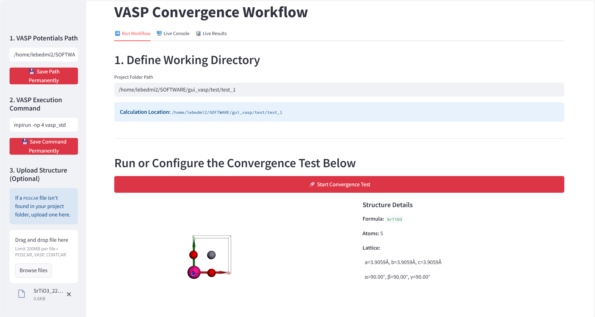
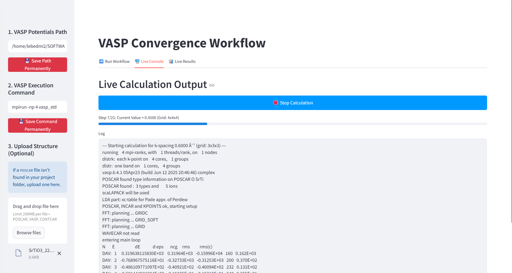
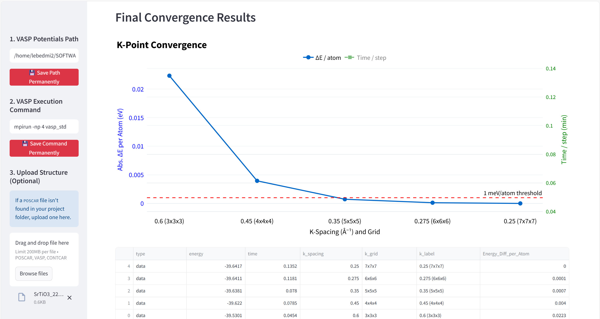

# convergence-tests-vasp-gui
GUI for automatic creation of POTCAR for POSCAR and calculations energy cut-off (Ecut) and k-space sampling convergence in VASP.
Video tutorial here: **[YouTube](https://youtu.be/lCK-NT9ejHQ)**. GUI is based on collection of my previous VASP scripts: https://github.com/bracerino/VASP_scripts.

## How to compile:
- git clone https://github.com/bracerino/convergence-vasp-gui.git
- cd convergence-vasp-gui/  
- python3 -m venv ven0_env  
- source ven0_env/bin/activate  
- pip install -r requirements.txt  
- streamlit run app.py

### Tested Python packages  
Python 3.12.3

- streamlit==1.45.1
- pandas==2.2.3
- plotly==6.1.2
- py3Dmol==2.4.2
- pymatgen==2025.5.28
- psutil==7.0.0

## Current functions
- Permanently set PATH to your POTCAR folder. Upload POSCAR structure and POTCAR will be automatically created, which you can optionally download.

- Set parameters for energy cut-off (Ecut) and k-space sampling and run the convergence test. You can see in realtime the updated convergence plot after each step is finished. In the sidebar, do not forget to set the vasp command that will be run 'e.g. mpirun -np 4 vasp_std'.

